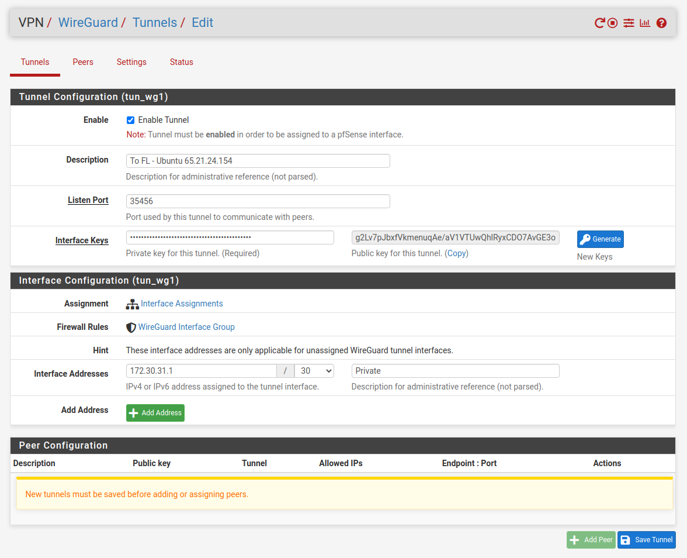
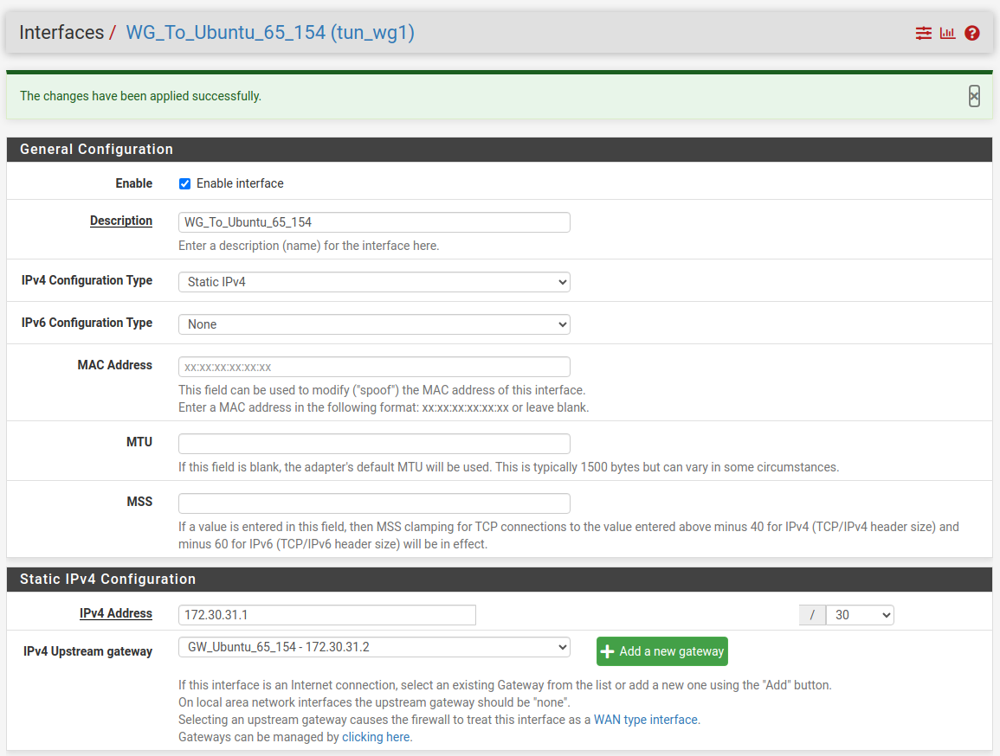

65.21.24.154

g2Lv7pJbxfVkmenuqAe/aV1VTUwQhlRyxCDO7AvGE3o=

## Step 1

## Step 2

## Step 3

## Install Wireguard in Ubuntu

    sudo apt update && sudo apt install wireguard -y

    cd /etc/wireguard

    ls

# Configs Keys

### Generate Keys

    wg genkey | tee privatekey | wg pubkey > publickey

### cat publickey

    vgZocbtPbppxEba4F9MkmK7HO4ou9byq6ugpp3iyNBk=

Note: Paste Ubuntu Publickey To PFsense Peers 

### cat privatekey

    UCcVT4BCnvpPlK9TtOwSHPHR4dQ9QJfruFqZhFgsM38=

Note: Paste Ubuntu privatekey To wg0.conf PrivateKey Section

vim /etc/wireguard/wg0.conf

    [Interface]
    # Name = laptop.example-vpn.dev
    Address = 172.30.31.2
    PrivateKey = UCcVT4BCnvpPlK9TtOwSHPHR4dQ9QJfruFqZhFgsM38=
    #DNS = 1.1.1.1
    ListenPort = 43553

    [Peer]
    # Name = server.example-vpn.tld
    Endpoint = 37.152.190.80:35456
    PublicKey = g2Lv7pJbxfVkmenuqAe/aV1VTUwQhlRyxCDO7AvGE3o=    #Paste PFsense Publickey to Ubuntu Peers
    #AllowedIPs = 0.0.0.0/0
    PersistentKeepalive = 25
    
## Up Tunnell

    wg-quick up wg0
    wg-quick down wg0

##

    wg show